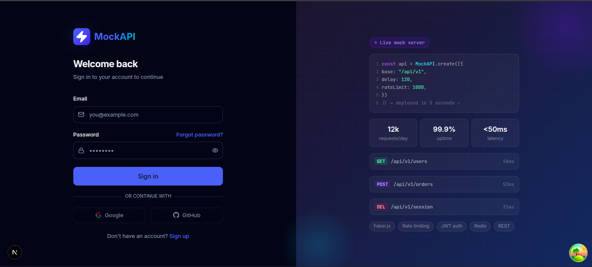
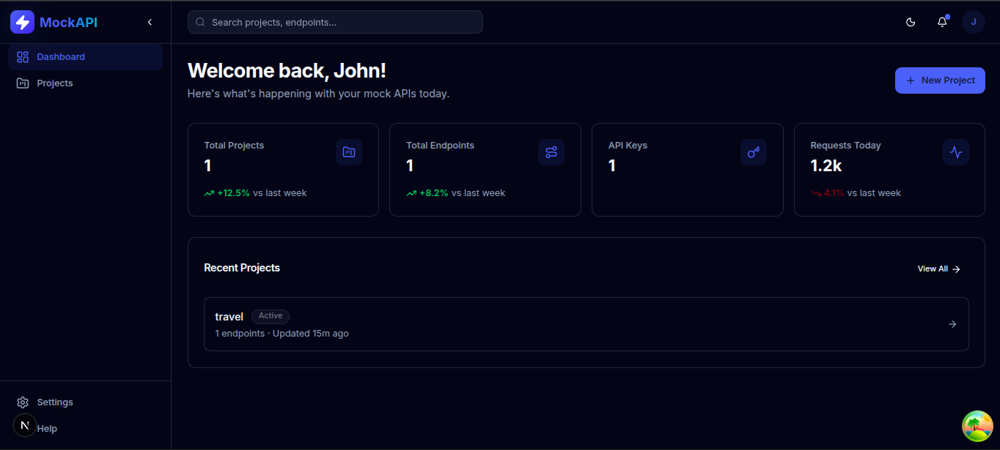
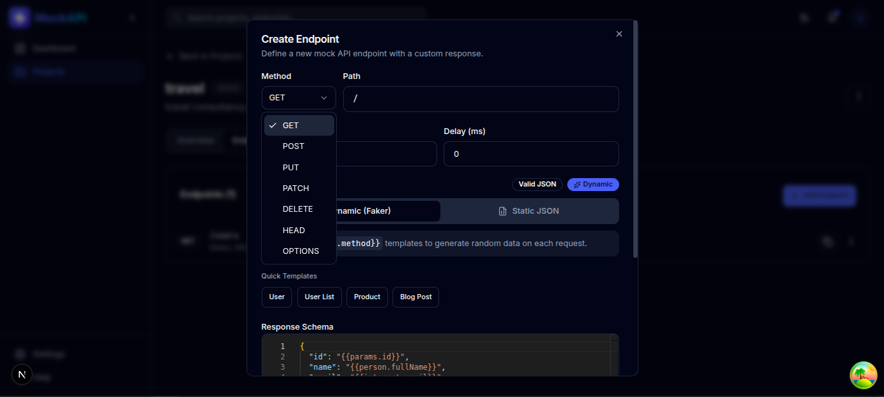
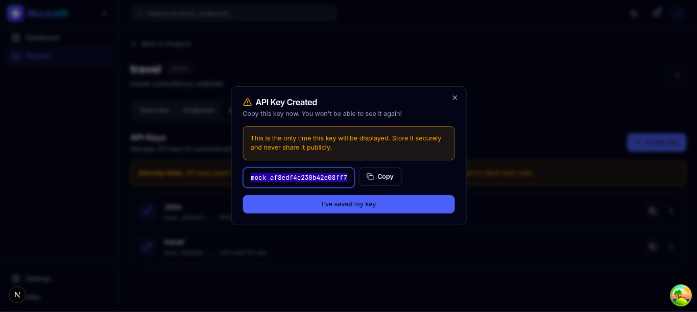
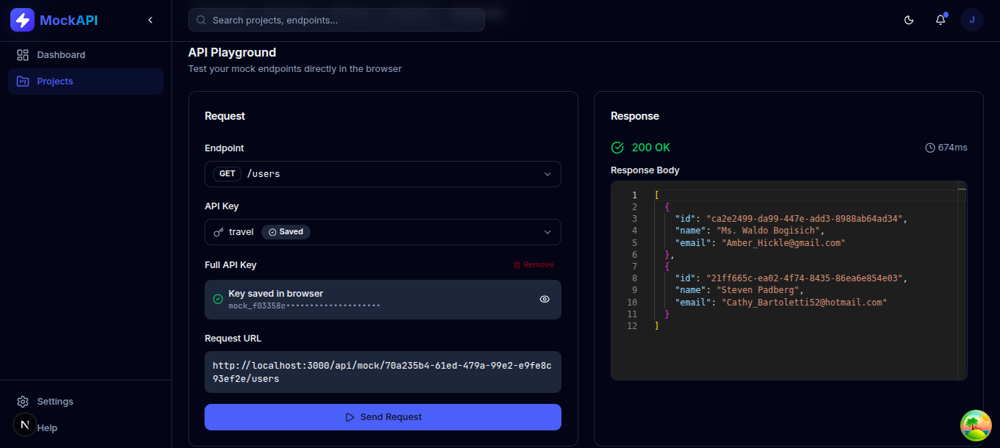
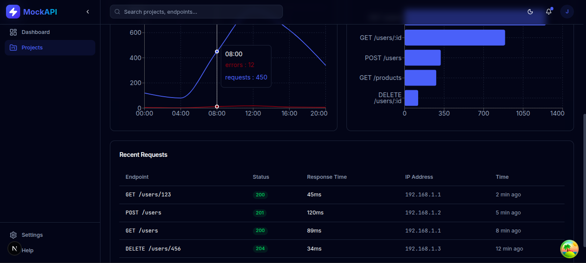
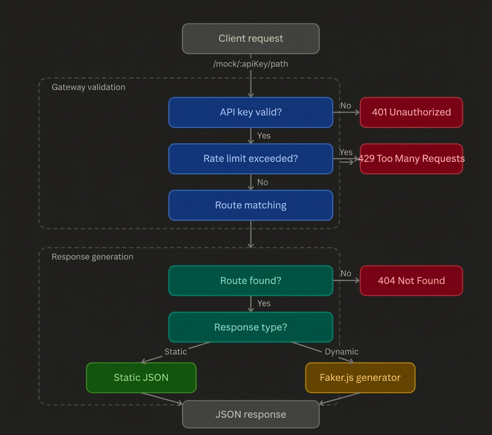

<div align="center">
  <h1>🔌 Mock API Gateway</h1>
  <p>Simulate real API endpoints for frontend and integration testing — no live backend required.</p>

  
  
  
  
  
</div>

---

## What is Mock API Gateway?

A web-based platform for designing and managing fake APIs during development and testing. Create projects, define custom endpoints, generate API keys, and test everything via the built-in playground — no live backend required.

Built for **frontend developers**, **QA engineers**, and **teams** who need reliable mock services without blocking on backend availability.

---

## Screenshots

<table>
  <tr>
    <td></td>
    <td></td>
  </tr>
  <tr>
    <td align="center">Login</td>
    <td align="center">Dashboard</td>
  </tr>
  <tr>
    <td></td>
    <td></td>
  </tr>
  <tr>
    <td align="center">Create Endpoint</td>
    <td align="center">API Key Management</td>
  </tr>
  <tr>
    <td></td>
    <td></td>
  </tr>
  <tr>
    <td align="center">API Playground</td>
    <td align="center">Analytics</td>
  </tr>
</table>

---

## Features

- **API key–based authentication** with per-project keys for secure access control
- **Flexible route matching** with custom HTTP methods, paths, query params, and headers
- **Configurable mock responses** — status codes, headers, and JSON bodies per endpoint
- **Dynamic data generation** using Faker.js to return realistic, randomized payloads
- **Redis-backed rate limiting** and throttling on a per–API key basis
- **JWT-protected dashboard** for secure login and session management
- **Project and endpoint management** to organize mocks by application or environment
- **Built-in API playground** to interactively test endpoints directly from the browser

---

## Tech Stack

**Backend**
- Node.js & TypeScript
- Express (HTTP server & routing)
- Prisma ORM
- PostgreSQL via Neon
- Redis via Upstash (rate limiting & caching)
- BullMQ (background jobs)

**Frontend**
- Next.js 15 (App Router)
- TypeScript
- Tailwind CSS

**Infrastructure**
- Docker & Docker Compose
- Neon (managed PostgreSQL)
- Upstash (managed Redis)

---

## Getting Started

### Prerequisites

- [Docker](https://www.docker.com/) & Docker Compose
- [Node.js 20+](https://nodejs.org/)
- [Neon](https://neon.tech/) account (PostgreSQL)
- [Upstash](https://upstash.com/) account (Redis)

### Local Development

**1. Clone the repository**

```bash
git clone https://github.com/yourusername/mock-api-gateway.git
cd mock-api-gateway
```

**2. Set up environment variables**

```bash
cp backend/.env.example backend/.env
cp frontend/.env.example frontend/.env.local
```

Fill in your Neon and Upstash credentials. All variables are documented in the example files.

**3. Run database migrations**

```bash
cd backend
npx prisma migrate deploy
```

**4. Start the application**

```bash
docker compose up --build
```

| Service  | URL                   |
| -------- | --------------------- |
| Frontend | http://localhost:3000 |
| Backend  | http://localhost:5000 |

---

## Architecture

### Request Pipeline
```
Incoming Request
      ↓
API Key Validation
      ↓
Rate Limit Check (Upstash Redis)
      ↓
Route Matching (path-to-regexp)
      ↓
Static Response or Faker.js Generator
      ↓
JSON Response
```

### How Mock Routes Work

1. User creates a project and generates an API key from the dashboard
2. User defines endpoints — HTTP method, path, optional query params and headers
3. Each endpoint has a configured response — status code, headers, JSON body or Faker.js template
4. Client hits `/mock/:apiKey/your-path`
5. Gateway validates the key, checks rate limit via Redis, matches the route, and returns the configured response

### API Flowchart



---

## API Reference

> All dashboard routes require `Authorization: Bearer <token>` header.
> All `/mock` routes require a valid API key in the URL.

### Auth

| Method | Endpoint             | Description            |
| ------ | -------------------- | ---------------------- |
| POST   | `/api/auth/register` | Register a new account |
| POST   | `/api/auth/login`    | Login and receive JWT  |
| POST   | `/api/auth/logout`   | Invalidate session     |

### Projects

| Method | Endpoint            | Description          |
| ------ | ------------------- | -------------------- |
| GET    | `/api/projects`     | List all projects    |
| POST   | `/api/projects`     | Create a new project |
| DELETE | `/api/projects/:id` | Delete a project     |

### Endpoints

| Method | Endpoint                           | Description                  |
| ------ | ---------------------------------- | ---------------------------- |
| GET    | `/api/projects/:id/endpoints`      | List endpoints for a project |
| POST   | `/api/projects/:id/endpoints`      | Create a mock endpoint       |
| PUT    | `/api/projects/:id/endpoints/:eid` | Update an endpoint           |
| DELETE | `/api/projects/:id/endpoints/:eid` | Delete an endpoint           |

### Mock Gateway

| Method | Endpoint          | Description          |
| ------ | ----------------- | -------------------- |
| ANY    | `/mock/:apiKey/*` | Hit a mock endpoint  |

---

## Environment Variables

All required variables and descriptions are documented in:

- [`backend/.env.example`](./backend/.env.example)
- [`frontend/.env.example`](./frontend/.env.example)

---

## License

MIT License. See [LICENSE](./LICENSE) for details.